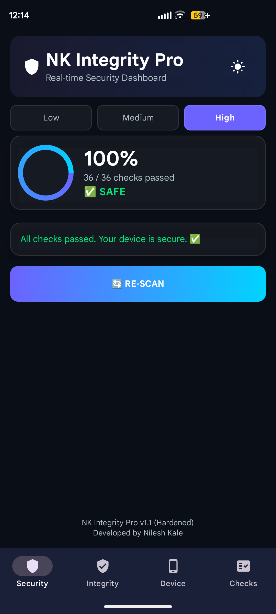
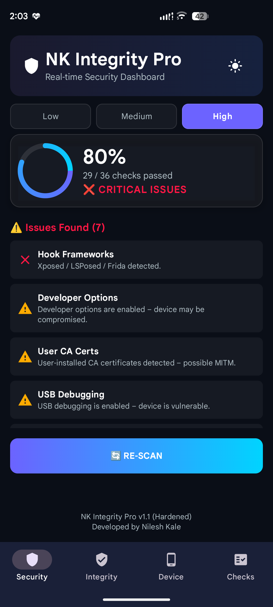
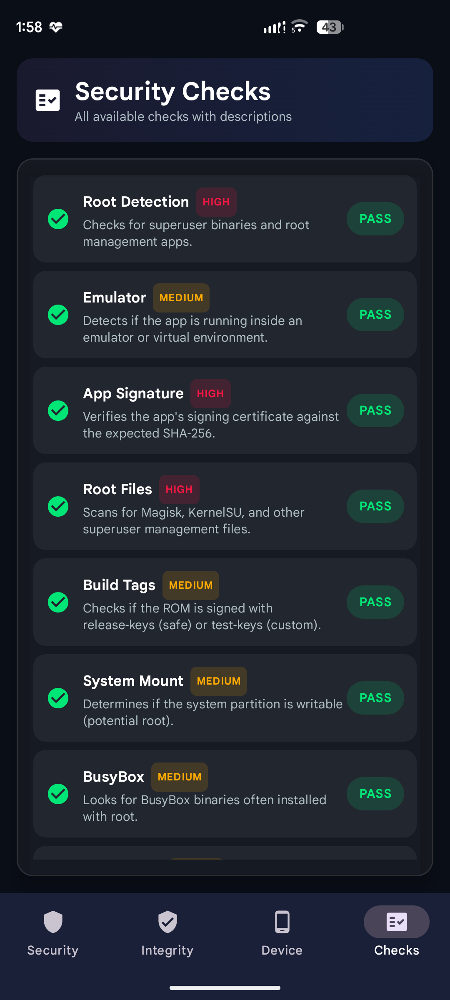

# NK Integrity Pro

A native Android security/integrity self-check dashboard. Runs 36 local device-tamper checks —
including a small native/JNI layer for checks Kotlin alone can't perform — plus a server-verified
Google Play Integrity attestation, and reports results in a clean, real-time dashboard.

## Screenshots

| Clean device | Issues detected | Per-check detail |
|---|---|---|
|  |  |  |

## Why

Most "root check" sample code online relies on a handful of easily-defeated signals — checking for
`/system/bin/su`, or asking `PackageManager` whether Magisk is installed. Root-hiding tools built
on Zygisk/Shamiko-class frameworks are specifically designed to spoof exactly those checks. NK
Integrity Pro layers multiple independent detection techniques, several of which don't rely on
the filesystem or package manager at all:

- **Hardware Attestation** — generates a throwaway hardware-backed (TEE/StrongBox) key and reads
  its attestation certificate for verified-boot state and bootloader lock. Defeating this
  convincingly requires a forged TEE keybox, not just hiding files.
- **Native Library Injection** — scans this process's own live `/proc/self/maps` and thread list
  for the actual runtime footprint of Frida/Xposed/LSPosed, rather than asking `PackageManager`
  whether a hooking app is "installed."
- **TrustManager Tamper Check** — reflectively walks the installed `SSLSocketFactory`'s object
  graph to detect a globally-installed trust-all `TrustManager` (the standard SSL-pinning-bypass
  technique), correctly distinguishing it from Android's own legitimate Network Security Config
  wrapper.
- **Active Ptrace Self-Test** (native/JNI) — calls `ptrace(PTRACE_TRACEME)` on itself. A process
  can only have one tracer at a time, so this fails if a debugger or Frida is already attached,
  even if it's spoofing `TracerPid` at the Java level.
- **GOT/Symbol Hook Check** and **Inline Hook Check** (native/JNI) — resolve common libc functions
  and verify their addresses fall inside libc.so's own mapped memory range, then inspect the first
  bytes at those addresses for an ARM64 branch-instruction trampoline (the pattern Frida's default
  `Interceptor.attach()` writes at a hooked function's entry point).

No single check is bulletproof on its own — that's the point. Each targets a different layer
(filesystem, package manager, native memory, hardware attestation, server-verified integrity), so
defeating all of them convincingly requires meaningfully more effort than any one technique alone.

## Features

**36 local security checks**, filterable by severity (Low/Medium/High):

| Check | Severity | What it does |
|---|---|---|
| Root Detection | High | RootBeer-based su binary / root-management-app scan |
| Emulator | Medium | Hardware fingerprint + known emulator file check |
| App Signature | High | Verifies the signing certificate against an expected SHA-256 |
| Root Files | High | Scans for Magisk/KernelSU files |
| Build Tags | Medium | `release-keys` vs `test-keys` |
| System Mount | Medium | Whether `/system` is writable |
| BusyBox | Medium | BusyBox binary presence |
| Bootloader | Medium | Bootloader lock state |
| SELinux | Medium | Enforcing vs permissive/disabled |
| Hook Frameworks | High | Xposed/LSPosed package + stack-trace detection |
| Debugger | High | `Debug.isDebuggerConnected()` |
| Tracer PID | High | `/proc/self/status` TracerPid |
| VPN Detection | Medium | Active VPN transport check |
| Developer Options | Low | Whether dev options are enabled |
| User CA Certs | Medium | User-installed CA certificates (possible MITM) |
| USB Debugging | Low | ADB debugging state |
| Accessibility Services | Low | Enabled accessibility services (clickjacking risk) |
| Overlay Apps | Medium | Apps holding `SYSTEM_ALERT_WINDOW` |
| Unknown Sources | Low | Sideloading setting |
| Debug Build | High | `FLAG_DEBUGGABLE` |
| Advanced Emulator | High | `ro.kernel.qemu` / Goldfish / Ranchu / Cuttlefish signatures |
| SSL Pinning Health | High | Independently re-verifies the backend's certificate pin |
| TrustManager Tamper Check | High | Detects a globally-overridden trust-all `SSLContext` |
| MITM Proxy Detection | Medium | Active system HTTP proxy |
| Root Manager Launch Probe | High | Two-layer PackageManager + real-launch-attempt probe |
| Hardware Attestation | High | TEE/StrongBox verified-boot + bootloader-lock check |
| Native Library Injection | High | Live memory-map + thread-name scan for Frida/Xposed |
| Insecure Build Properties | High | `ro.secure` / `ro.debuggable` system property check |
| Installer Source | Medium | Verifies install came from Google Play |
| Frida Server Port Scan | High | Local scan for a listening frida-server (27042/27043) |
| Magisk Socket Leak | High | `magiskd`'s abstract Unix domain socket in `/proc/net/unix` (often blocked by SELinux on Android 10+) |
| Mount Namespace Leak | High | OverlayFS-over-`/system` leak in `/proc/self/mountinfo` |
| Attestation Key Revocation | High | Checks the hardware attestation chain against Google's server-side revocation list (catches a leaked/stolen keybox even if Hardware Attestation is spoofed) |
| Active Ptrace Self-Test | High | Native: `ptrace(PTRACE_TRACEME)` self-test — a process can only have one tracer at a time |
| GOT/Symbol Hook Check | High | Native: verifies common libc symbols resolve inside libc.so's own mapped range |
| Inline Hook Check | High | Native: scans for an ARM64 branch-instruction trampoline at the start of those same libc functions |

**Play Integrity tab** — requests a Google Play Integrity token and sends it to your own backend
for server-side verification (device integrity, app recognition, and licensing verdicts). The
client never trusts a local verdict for this signal; Google verifies it server-side.

**Device Info tab** — full hardware/software/network snapshot, with sensitive identifiers (Android
ID, WiFi MAC, Advertising ID) masked by default.

## Architecture notes

- Kotlin + Jetpack Compose (Material 3), MVVM (`MainViewModel` + Compose state), with a small
  native/JNI layer (`app/src/main/cpp/nk_native_checks.cpp`, bridged via `NativeChecks.kt`) for the
  3 checks Kotlin alone can't perform (an active `ptrace()` syscall, GOT/symbol and inline-hook
  inspection). Builds for `arm64-v8a` and `x86_64`.
- No reflection-based JSON serialization — `org.json.JSONObject` used directly, so R8 can fully
  obfuscate/shrink the app's own detection logic in release builds without needing broad `-keep`
  rules (a deliberate choice for this kind of app — see `app/proguard-rules.pro`).
- ASN.1 parsing of the key-attestation certificate extension uses BouncyCastle
  (`org.bouncycastle:bcprov-jdk18on`) rather than hand-rolled DER parsing.
- Backend calls are certificate-pinned via `network_security_config.xml`, verified independently
  by the "SSL Pinning Health" check at runtime (not just relying on the OS-level config).

## Setup

1. Copy `gradle.properties.example` to `gradle.properties` and fill in your own values:
   - `NK_EXPECTED_SIGNATURE_HASH_DEBUG` / `_RELEASE` — your debug and release signing
     certificates' SHA-256 (uppercase hex, no colons) — split because debug and release builds are
     signed with different keystores, so a single value can never be correct for both:
     `apksigner verify --print-certs your.apk`
   - `NK_BACKEND_BASE_URL` — your backend's base URL (must implement `/health` and
     `/verify-integrity`, and must be declared with a certificate pin in
     `app/src/main/res/xml/network_security_config.xml`)
   - `NK_CLOUD_PROJECT_NUMBER` — your Google Cloud project number with the
     [Play Integrity API](https://developer.android.com/google/play/integrity/setup) enabled
   - `NK_PINNING_TESTBED_URL` — optional, a separate backend used only for debug-build SSL-pinning
     self-tests, kept apart from production so bypass experiments never touch it
   - `NK_RELEASE_KEYSTORE_FILE` / `_PASSWORD` / `NK_RELEASE_KEY_ALIAS` / `_PASSWORD` — only needed
     to build a signed release APK (`./gradlew assembleRelease`); generate a keystore with
     `keytool -genkeypair -v -keystore your-release.jks -storetype PKCS12 -alias your-alias
     -keyalg RSA -keysize 2048 -validity 10950` and **back it up somewhere durable** — losing it
     means you can never sign an update to this app under the same identity again.
2. `./gradlew assembleDebug` (or open in Android Studio and run).

`gradle.properties` is gitignored — never commit your real values. Keystores (`*.jks`/`*.keystore`)
are gitignored too, regardless of location.

## Backend

This repo is client-only. You'll need your own backend implementing:
- `GET /health` — trivial warm-up ping.
- `POST /verify-integrity` — accepts `{"token": "..."}`, verifies it against the
  [Play Integrity decoding API](https://developer.android.com/google/play/integrity/verdict), and
  returns the decoded verdict JSON.

## License

Developed by [Nilesh Kale](https://github.com/nileshkale12).
